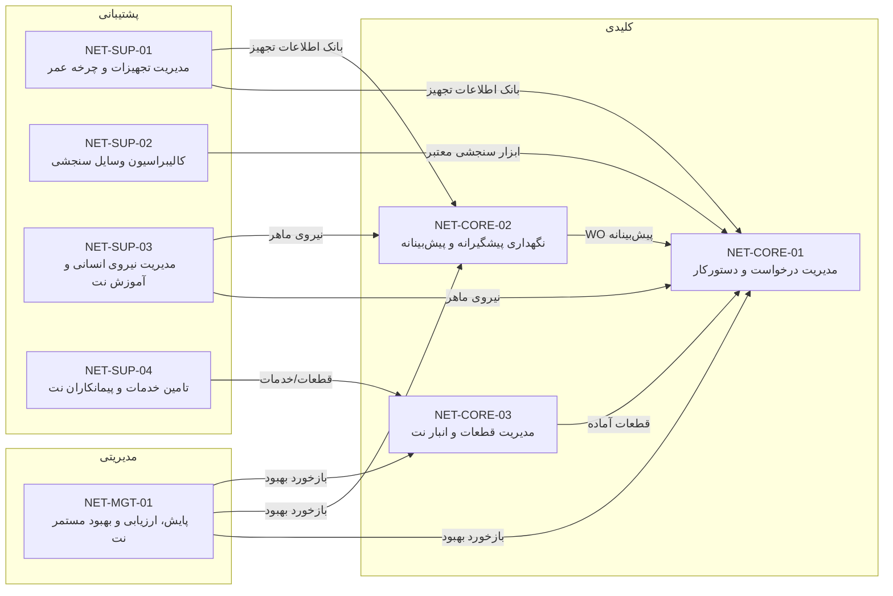

# شناسنامه‌های فرایندی سیستم مدیریت نگهداری و تعمیرات (نت)
## شرکت بسپار فوم غرب — مطابق الزامات ISO 9001:2015

| مورد | مشخصات |
|---|---|
| **کد سند** | BFG-QMS-PRC-01 |
| **نسخه** | 1.0 |
| **تاریخ تنظیم** | ۱۴۰۵/۰۶/۱۶ (مبنای میلادی: 07 Sep 2026) |
| **مالک سند** | مدیر نگهداری و تعمیرات |
| **تهیه‌کننده** | مدیر سیستم کیفیت / مدیر نت |
| **تاییدکننده** | مدیریت سایت |
| **حوزه کاربرد** | واحد نگهداری و تعمیرات کارخانه بسپار فوم غرب |
| **مبنای فرایندی** | مدل ساختار نت پیاده‌سازی‌شده در سامانه BFG CMMS نسخه 4.0.0 |
| **استناد** | بند 4.4 استاندارد ISO 9001:2015 (رویه فرایندی) |

---

## الف) نقشه کلان فرایندهای نت

---

## ب) جدول خلاصه فرایندها

| کد فرایند | نام فرایند | طبقه‌بندی | مالک فرایند | ماژول سامانه |
|---|---|---|---|---|
| NET-CORE-01 | مدیریت درخواست و دستورکار | کلیدی | سرپرست واحد نت | «درخواست‌ها»، «دستورکارها» |
| NET-CORE-02 | نگهداری پیشگیرانه و پیش‌بینانه | کلیدی | کارشناس PM/PdM | «برنامه‌ریزی PM» + «دستورکارها» |
| NET-CORE-03 | مدیریت قطعات و انبار نت | کلیدی | سرپرست انبار نت | «انبار مواد و قطعات» |
| NET-SUP-01 | مدیریت تجهیزات و چرخه عمر | پشتیبانی | سرپرست واحد نت | «تجهیزات و CAD» |
| NET-SUP-02 | کالیبراسیون وسایل سنجشی | پشتیبانی | ناظر کیفیت/متامترولوژی | «کالیبراسیون» |
| NET-SUP-03 | مدیریت نیروی انسانی و آموزش نت | پشتیبانی | مدیر نت + منابع انسانی | «پرسنل و رزومه» |
| NET-SUP-04 | تامین خدمات و پیمانکاران نت | پشتیبانی | سرپرست انبار نت / بازرگانی | «انبار» + مستندات خرید |
| NET-MGT-01 | پایش، ارزیابی و بهبود مستمر نت | مدیریتی | مدیر نت | «داشبورد KPI» + «گزارش‌ها» |

---

<!-- ========================== CORE-01 ========================== -->
## ۱. شناسنامه فرایند NET-CORE-01 — مدیریت درخواست و دستورکار

| ردیف | مولفه شناسنامه | شرح |
|---|---|---|
| ۱ | کد و نام فرایند | **NET-CORE-01 — مدیریت درخواست خرابی تا تحویل کار (Request-to-Close)** |
| ۲ | طبقه‌بندی | فرایند کلیدی (Core Process) |
| ۳ | بند استاندارد مرتبط | 4.4.1، 8.5.1 (تولید و ارائه خدمت تحت شرایط برنامه‌ریزی‌شده)، 7.5.3 |
| ۴ | مالک فرایند | سرپرست واحد نت (در غیاب: سرپرست کشیک) |
| ۵ | هدف فرایند | پاسخ‌گویی سریع، ردیابی‌پذیر و مستند به تمام نیازهای نت؛ تضمین اتمام صحیح هر کار با سوابق کامل فنی، زمان، قطعه و امضای دیجیتال |
| ۶ | دامنه / مرز فرایند | **شروع:** ثبت درخواست خرابی (کاغذی/تلفنی -> «درخواست‌ها») یا صدور WO پیش‌بینانه — **پایان:** بستن و تحویل تجهیز به تولید با ثبت گزارش کار |
| ۷ | ورودی‌ها | درخواست خرابی تولید؛ خروجی برنامه PM؛ گزارش بازدید دوره‌ای؛ درخواست‌های خدمات از سایر واحدها |
| ۸ | صادرکننده ورودی | واحد تولید، سرپرست کشیک، کارشناس PM
| ۹ | فعالیت‌های اصلی | ۱) ثبت درخواست و تخصیص کد توالی‌دار — ۲) بررسی و تبدیل به دستورکار — ۳) اولویت‌بندی (فوری/کم‌ارزش/برنامه‌ای) — ۴) تخصیص تکنسین/تیم — ۵) اجرای کار و ثبت زمان شروع/پایان — ۶) ثبت قطعات مصرفی از انبار — ۷) گزارش کار (علت خرابی، اقدام انجام‌شده) — ۸) امضای دیجیتال تکنسین و سرپرست — ۹) تحویل به تولید و بستن WO |
| ۱۰ | خروجی‌ها | دستورکار تکمیل‌شده؛ گزارش کار با امضای دیجیتال؛ سوابق قطعه‌کاری مصرف‌شده؛ داده خام محاسبه MTTR/MTBF؛ لیست کارهای عقب‌افتاده |
| ۱۱ | دریافت‌کننده خروجی | تولید (مشتری داخلی)، مدیر نت، مدیر کارخانه، حسابداری (هزینه‌سازی قطعات) |
| ۱۲ | منابع و زیرساخت | تکنسین/نگهبان مجاز؛ ابزار و اقلام امانی؛ سامانه BFG CMMS (ماژول‌های درخواست‌ها/دستورکارها)؛ نقشه‌های فنی و CAD؛ قطعات یدکی انبار نت؛ زون‌بندی تجهیزات |
| ۱۳ | اطلاعات مستند (فرم/شیوه‌نامه) | فرم درخواست تعمیر: `BFG-NET-FRM-001` — رویه ایمنی نت: `BFG-NET-PRC-001` — دستورالعمل مجوز کار (Permit to Work) در صورت نیاز |
| ۱۴ | سوابق قابل نگهداری | سوابق ارسال/تکمیل/بسته‌شدن WO در سامانه (SQL)؛ امضاهای دیجیتالی PNG؛ لاگ تغییرات؛ چاپ گزارش کار |
| ۱۵ | ریسک‌ها (بند 6.1) | تأخیر در اجرای کارهای فوری؛ عدم تخصص در خرابی پیچیده؛ نبود قطعه کرونری؛ ثبت ناقص گزارش کار (کاهش قابلیت تحلیل ماهانه) |
| ۱۶ | فرصت‌ها (بند 6.1) | تحلیل Pareto علت‌های خرابی برای ازردن خرابی‌های تکراری؛ پوشش شناسنامه تجهیز با نقشه CAD برای کاهش زمان عیب‌یابی؛ MOTIF از کد خرابی به‌روش استاندارد |
| ۱۷ | تعامل با سایر فرایندها | دریافت قطعه از NET-CORE-03؛ داده زمان/تکنسین به NET-MGT-01؛ وضعیت تجهیز به NET-SUP-01؛ تخصص لازم از NET-SUP-03 |
| ۱۸ | روش پایش و ارزیابی | داشبورد KPI روزانه: تعداد WOهای باز و نرخ عقب‌افتادگی؛ بررسی ماهانه در NET-MGT-01؛ جلسه صبحگاهی تعمیرات |

### شاخص‌های کلیدی عملکرد NET-CORE-01

| کد | شاخص | فرمول محاسبه | هدف | مقطع پایش |
|---|---|---|---|---|
| K-01 | متوسط زمان اجرای کار (MTTR نمایشی سامانه) | مجموع ساعت شروع تا پایان WOهای بسته ÷ تعداد | ≤ ۴ ساعت | ماهانه |
| K-02 | کارهای عقب‌افتاده (Backlog) | WOهای باز با سررسید گذشته ÷ کل بازها × ۱۰۰ | ≤ ۵٪ | هفتگی |
| K-03 | درصد تکمیل WO در سررسید | بسته‌شده در مهلت ÷ کل بسته‌شده ×۱۰۰ | ≥ ۹۰٪ | ماهانه |
| K-04 | پوشش امضای دیجیتال | WOهای دارای امضای تکنسین+سرپرست ÷ کل | ۱۰۰٪ | ماهانه |
| K-05 | پاسخ به خرابی‌های فوری (Break-in) | پاسخ ≤ ۳۰ دقیقه ÷ کل فوری‌ها | ≥ ۹۵٪ | ماهانه |

---

<!-- ========================== CORE-02 ========================== -->
## ۲. شناسنامه فرایند NET-CORE-02 — نگهداری پیشگیرانه و پیش‌بینانه (PM / PdM)

| ردیف | مولفه شناسنامه | شرح |
|---|---|---|
| ۱ | کد و نام فرایند | **NET-CORE-02 — نگهداری پیشگیرانه و پیش‌بینانه** |
| ۲ | طبقه‌بندی | فرایند کلیدی |
| ۳ | بند استاندارد مرتبط | 7.1.3 (زیرساخت)، 8.5.1، 9.1.1 |
| ۴ | مالک فرایند | کارشناس PM/PdM تحت نظارت سرپرست واحد نت |
| ۵ | هدف | کاهش خرابی‌های غیربرنامه‌ای و توقف تولید; افزایش در دسترس‌پذیری تجهیزات با برنامه‌های دوره‌ای، بازدیدهای سایت و پایش وضعیت |
| ۶ | دامنه / مرز | **شروع:** تعریف چک‌لیست/برنامه در «برنامه‌ریزی PM» — **پایان:** صدور خودکار WO، اجرا در موعد و ثبت نتایج پایش |
| ۷ | ورودی‌ها | برنامه کاری دستگاه (از دستورالعمل سازنده/تجربیات); شناسنامه تجهیز; تاریخچه خرابی‌ها؛ آستانه‌های شرایطی (دمای گیربکس، لرزش، حسگر فشار) |
| ۸ | صادرکننده ورودی | مهندس نت، NET-SUP-01 (چرخه عمر تجهیز) |
| ۹ | فعالیت‌های اصلی | ۱) تعریف برنامه (روزمره، ۷روزه، ماهانه، سالانه) — ۲) ارسال به تقویم نت و صدور خودکار WO در سررسید — ۳) اجرای چک‌لیست و ثبت اعداد بحرانی/تصاویر — ۴) بازدید دوره‌ای با قفل گردی — ۵) تحلیل روند و صدور WO اصلاحی در صورت انحراف — ۶) بازبینی اثربخشی برنامه |
| ۱۰ | خروجی‌ها | WO پیش‌بینانه انجام‌شده؛ گزارش‌های پایش شرایطی؛ هشدار انحراف؛ درصد انطباق PM |
| ۱۱ | دریافت‌کننده خروجی | NET-CORE-01 (اجرای WO)، تولید (اطمینان از سلامت دستگاه)، NET-MGT-01 (گزارش KPI) |
| ۱۲ | منابع و زیرساخت | سامانه CMMS «برنامه‌ریزی PM» + «تقویم نت»؛ تجهیزات پایش شرایطی; چرخه‌های کاری تولید؛ تیم پیمانکار در صورت برون‌سپاری |
| ۱۳ | اطلاعات مستند | چک‌لیست‌های PM داخل سيستم (`BFG-NET-CHK-xxx`) — رویه نگهداری پیش‌بینانه `BFG-NET-PRC-002` |
| ۱۴ | سوابق قابل نگهداری | تاریخچه اجرای هر برنامه؛ مقادیر پایش و TREND؛ عکس‌های گزارش پیوستی |
| ۱۵ | ریسک‌ها | عدم شکل‌گیری WO در روز سررسید؛ ناهماهنگی با برنامه تولید؛ چک‌لیست ناتقن؛ عدم اجرای WO صادرشده |
| ۱۶ | فرصت‌ها | انتقال PM به PdM با تحلیل روند چند ماهه؛ کاهش تعداد موارد با بهینه‌سازی فاصله‌های زمانی (Interval) |
| ۱۷ | تعامل | با NET-CORE-01 (صدور WO)، NET-SUP-01 (تعریف تجهیز)، NET-MGT-01 (محاسبه انطباق) |
| ۱۸ | روش پایش | «تقویم نت» روزانه; گزارش انطباق PM در قاب NET-MGT-01 |

### شاخص‌ها NET-CORE-02

| کد | شاخص | فرمول | هدف | مقطع پایش |
|---|---|---|---|---|
| K-01 | انطباق برنامه PM | WOهای PM انجام‌شده در روز سررسید ÷ کل WO مجوزدار منطقی ×۱۰۰ | ≥ ۹۵٪ | ماهانه |
| K-02 | نسبت خرابی‌های اضطراری به کل | WOهای اضطراری/خرابی (BD/CM) ÷ کل WO ×۱۰۰ | ≤ ۱۵٪ | ماهانه |
| K-03 | MTBF تجهیزات بحرانی | ساعت کارکرد ÷ تعداد خرابی همان دوره | افزایش ماهانه +5٪ | فصلی |
| K-04 | پوشش PdM | تجهیزات بحرانی دارای پایش شرایطی ÷ کل بحرانی‌ها | ≥ ۶۰٪ | سالانه |

---

<!-- ========================== CORE-03 ========================== -->
## ۳. شناسنامه فرایند NET-CORE-03 — مدیریت قطعات و انبار نت

| ردیف | مولفه شناسنامه | شرح |
|---|---|---|
| ۱ | کد و نام فرایند | **NET-CORE-03 — مدیریت قطعات یدکی، ورود/خروج و قیمت‌گذاری انبار نت** |
| ۲ | طبقه‌بندی | فرایند کلیدی |
| ۳ | بند استاندارد مرتبط | 7.5.3 (ردیابی‌پذیری)، 8.5.2 (نگهداری دارایی مشتری)، 8.4.2 |
| ۴ | مالک فرایند | سرپرست انبار نت |
| ۵ | هدف | تضمین در دسترس بودن قطعات یدکی با کیفیت و قیمت مناسب; جلوگیری از توقف تولید به‌علت کمبود; کنترل هزینه‌سازی نتچرخه‌ای در سامانه |
| ۶ | دامنه / مرز | **شروع:** درخواست خرید/رسید جنس — **پایان:** خروج قطعه به WO با سند انبار امضاشده و ثبت هزینه |
| ۷ | ورودی‌ها | درخواست خرید تکنسین/سرپرست; رسید خرید بازرگانی; WOهای مصرف‌کننده قطعه |
| ۸ | صادرکننده ورودی | NET-CORE-01، تدارکات / بازرگانی، واحد مالی |
| ۹ | فعالیت‌های اصلی | ۱) طبقه‌بندی کالا (مصرفی/الکتریکال/مکانیکال/…) — ۲) ورود جنس: رسید با قیمت خرید و ثبت موقعیت قفسه — ۳) تنظیم حداقل موجودی و نقطه سفارش — ۴) پیگیری‌سازی هشدار کمبود طبق کمینه — ۵) صدور سند حواله با امضای دیجیتال متقاضی و انباردار — ۶) رسیدگی به بستانکاری تأمین‌کننده — ۷) شمارش ادواری و مغایرت‌گیری |
| ۱۰ | خروجی‌ها | اسناد انبار امضاشده؛ گزارش موجودی و گردش انبار؛ فهرست کم‌موجودی؛ هزینه‌سازی WO |
| ۱۱ | دریافت‌کننده خروجی | NET-CORE-01؛ مالی (قیمت‌گذاری)؛ خرید/بازرگانی |
| ۱۲ | منابع و زیرساخت | انبارک نت مجاور سالن; سیستم انبار ماژول «انبار مواد و قطعات»؛ پرینتر چاپ سند; بارکدخوان در صورت اجرا |
| ۱۳ | اطلاعات مستند | رویه انبار نت `BFG-NET-PRC-003` — فرم رسید `BFG-NET-FRM-002` — فرم حواله `BFG-NET-FRM-003` |
| ۱۴ | سوابق قابل نگهداری | سوابق امضاهای انبارداری در سامانه; تاریخچه قیمت خرید; سوابق موجودی و قیمت (آرشیو) |
| ۱۵ | ریسک‌ها | کمبود قطعه حیاتی (توقف تولید); خطا در قیمت‌گذاری؛ عدم ثبت خروج; خرید غیراستاندارد اضطراری |
| ۱۶ | فرصت‌ها | تحلیل مصرف سالانه برای خرید بهینه و شرایط سالانه تأمین‌کننده; برچسب بارکد و تمام‌دیجیتال شدن |
| ۱۷ | تعامل | تامین WOهای NET-CORE-01؛ دریافت از NET-SUP-04; گزارش هزینه‌ها به NET-MGT-01 |
| ۱۸ | روش پایش | گزارش کم‌موجودی روزانه در داشبورد; ممیزی ادواری انبار; جلسات تسویه و ارزیابی فصلی تأمین‌کنندگان |

### شاخص‌ها NET-CORE-03

| کد | شاخص | فرمول | هدف | مقطع پایش |
|---|---|---|---|---|
| K-01 | سطح خدمت انبار | درخواست‌های تامین‌شده در لحظه ÷ کل درخواست‌ها | ≥ ۹۸٪ | ماهانه |
| K-02 | کالاهای کم‌تر از حداقل | تعداد کالاهای کم‌موجودی | ≤ ۵ قلم | روزانه |
| K-03 | مغایرت انبار | جمع خالص مغایرت ÷ ارزش کل موجودی | ≤ ۰/۵٪ | فصلی |
| K-04 | گردش موجودی | خروج ارزشی سالانه ÷ میانگین موجودی | ≥ ۲ دوره | سالانه |

---

<!-- ========================== SUP-01 ========================== -->
## ۴. شناسنامه فرایند NET-SUP-01 — مدیریت تجهیزات و چرخه عمر آن‌ها

| ردیف | مولفه شناسنامه | شرح |
|---|---|---|
| ۱ | نام/کد | **NET-SUP-01 — تعریف، فایل فنی و چرخه عمر تجهیزات** |
| ۲ | طبقه‌بندی | فرایند پشتیبانی |
| ۳ | بند استاندارد | 7.1.3 (زیرساخت)، 7.5 (اطلاعات مستند) |
| ۴ | مالک | سرپرست واحد نت |
| ۵ | هدف | داشتن بانک اطلاعاتی به‌روز و جامع از هر تجهیز (کد، مشخصات، نقشه CAD، SN، P&ID) به‌عنوان مرجع تمام فرایندهای کار گروه نت |
| ۶ | دامنه | **شروع:** تعریف تجهیز جدید (پس از ورود به کارخانه) — **پایان:** ارزیابی بازخرید/اسقاط و ثبت وضعیت |
| ۷ | ورودی‌ها | اسناد فنی خرید; پلاک/مارک تجهیز; نتایج نصب و راه‌اندازی اولیه; تاریخچه خرابی‌ها |
| ۸ | صادرکننده ورودی | خرید، پروژه‌های توسعه، مدیر نت |
| ۹ | فعالیت‌های اصلی | ثبت تجهیز در ماژول «تجهیزات و CAD» + کارت‌گذاری; ضمیمه نقشه‌ها و عکس‌ها; تعریف درخت تجهیزی (خط → ماشین → زیرمونتاژ); محاسبه/ضبط ساعت کارکرد; ارزیابی RUL (عمر باقی‌مانده); پیشنهاد جایگزینی یا اسقاط |
| ۱۰ | خروجی‌ها | فایل فنی هر تجهیز; درخت تجهیزی; گزارش عمر و RUL; تصمیم‌های بازخرید |
| ۱۱ | دریافت‌کننده | NET-CORE-01/02/03; مدیران نت و تولید |
| ۱۲ | منابع | ماژول «تجهیزات و CAD»; نقشه‌کش مهندسی فنی |
| ۱۳ | اسناد | رویه ثبت و شناسایی تجهیزات `BFG-NET-PRC-004` |
| ۱۴ | سوابق | تاریخچه تغییرات کارت تجهیز; تصاویر و نقشه‌ها در آرشیو سیستم |
| ۱۵ | ریسک‌ها | اطلاعات ناقص فایل تجهیز; بالاتر شدن RUL پیش از تصمیم بازخرید |
| ۱۶ | فرصت‌ها | رتبه‌بندی بحران (ABC) تجهیزات برای تمرکز PM بر تجهیزات بحرانی; یکپارچه‌سازی با سیستم مالی (استهلاک) |
| ۱۷ | تعامل | مبنای NET-CORE-01/02 و NET-SUP-02 |
| ۱۸ | روش پایش | ممیزی سالانه دقت بانک اطلاعات تجهیز; پراکندگی تصمیم‌های بازخرید |

### شاخص‌ها NET-SUP-01

| کد | شاخص | فرمول | هدف | موعد پایش |
|---|---|---|---|---|
| K-01 | پوشش فایل فنی | تجهیزات با کارت کامل ÷ کل | ۱۰۰٪ | سالانه |
| K-02 | دقت ساعت‌کار | تطابق ثبت ساعت کار با واقعیت در ممیزی | ≥ ۹۵٪ | فصلی |
| K-03 | ارزیابی RUL بحرانی | تجهیزات بحرانی با RUL محاسبه ÷ کل | ۱۰۰٪ | فصلی |

---

<!-- ========================== SUP-02 ========================== -->
## ۵. شناسنامه فرایند NET-SUP-02 — کالیبراسیون و نظرسنجی وسایل سنجشی

| ردیف | مولفه شناسنامه | شرح |
|---|---|---|
| ۱ | نام/کد | **NET-SUP-02 — کالیبراسیون و رعایت نظارت متامترولوژی** |
| ۲ | طبقه‌بندی | فرایند پشتیبانی |
| ۳ | بند استاندارد | 7.1.5 (منابع نظارتی و اندازه‌گیری) — یکی از حساس‌ترین بندهای ممیزی |
| ۴ | مالک | ناظر کیفیت (QC) با همکاری نت |
| ۵ | هدف | اطمینان از صحت وسایل سنجشی مؤثر بر پارامترهای کیفی و ایمنی (فشار، دما، لرزش و صحت شیرهای ایمنی) و پیگیری‌پذیری سررسیدها |
| ۶ | دامنه | **شروع:** شناسایی ابزار سنجشی مؤثر در نقطه اندازه‌گیری — **پایان:** کالیبراسیون، چسب برچسب و صدور گواهی |
| ۷ | ورودی‌ها | فهرست وسایل سنجشی; آستانه خطای مجاز; گواهینامه‌های آزمایشگاه متامترولوژی |
| ۸ | صادرکننده | QC / آزمایشگاه‌های معتمد |
| ۹ | فعالیت‌ها | ثبت وسیله در «کالیبراسیون»; تعیین پریود دوره‌ای بر اساس انواع (ابزارهای ساده/ابزارهای دقیق); صدور هشدار یک ماه قبل سررسید; تحویل به آزمایشگاه; ثبت نتایج و تصمیم در صورت خارج از تحمل (تعویض/دوباره‌کاری/ارجاع به تولید); برچسب‌گذاری |
| ۱۰ | خروجی‌ها | گواهی کالیبراسیون مهرشده; فهرست پیش‌رو سررسیدها; اقدام در مورد وسایل خارج از کالیبراسیون |
| ۱۱ | دریافت‌کننده | QC، تولید، ممیزی‌های بیرونی ISO |
| ۱۲ | منابع | ماژول «کالیبراسیون» سامانه; آزمایشگاه‌های الکترونیکی/مکانیکی سرشناس |
| ۱۳ | اسناد | رویه مدل متامترولوژی `BFG-QC-PRC-002` |
| ۱۴ | سوابق | تاریخچه کالیبراسیون هر وسیله; کپی گواهینامه‌ها در موارد PDF پیوستی |
| ۱۵ | ریسک‌ها | عبور سررسید وسیله حیاتی (اندازه‌گیری غلط = عدم انطباق محصول); طولانی شدن نوبت آزمایشگاه |
| ۱۶ | فرصت‌ها | کاهش خطا با تعیین پریود بر اساس تاریخچه انحراف به‌جای یاد|
| ۱۷ | تعامل | اثر بر NET-CORE-01 (آب هنرى تجهیز) و کیفیت محصول |
| ۱۸ | روش پایش | گزارش «این ماه پیش‌رو» هر ماه; بازی‌سازی قبل از ممیزی ISO |

### شاخص‌ها NET-SUP-02

| کد | شاخص | فرمول | هدف | مقطع |
|---|---|---|---|---|
| K-01 | انطباق برنامه کالیبراسیون | کالیبره‌شده در مهلت ÷ برنامه تعیین‌شده | ۱۰۰٪ | ماهانه |
| K-02 | درصد موارد خارج از تحمل | ابزارهای خارج از تحمل ÷ کل | ≤ ۵٪ | فصلی |
| K-03 | تصمیم‌سازی به‌موقع (ازسررسید تا تصمیم) | میانگین روز | ≤ ۵ روز | در هر مورد |

---

<!-- ========================== SUP-03 ========================== -->
## ۶. شناسنامه فرایند NET-SUP-03 — مدیریت نیروی انسانی و آموزش نت

| ردیف | مولفه شناسنامه | شرح |
|---|---|---|
| ۱ | نام/کد | **NET-SUP-03 — تامین، نگهداشت و توسعه سرمایه انسانی نت** |
| ۲ | طبقه‌بندی | فرایند پشتیبانی |
| ۳ | بند استاندارد | 7.2 (منابع انسانی / صلاحیت)، 7.1.2 |
| ۴ | مالک | مدیر نت (به‌همراه منابع انسانی) |
| ۵ | هدف | داشتن پرسنل مجاز، به‌اندازه کافی و مهارت‌آموخته برای پشتیبانی فرایندهای نت; پوشش صلاحیت‌های مورد نیاز ایمنی و فنی |
| ۶ | دامنه | **شروع:** شناسایی نیاز نیرو/نیازمندی آموزشی — **پایان:** تأیید جذب، ثبت رزومه/گواهینامه و پایش اثربخشی آموزش |
| ۷ | ورودی‌ها | گزارش کمبود نیرو; مکانیسم ارزیابی از کار; درخواست‌های آموزشی کارکنان |
| ۸ | صادرکننده | مدیر نت، اداراه عمومی منابع انسانی |
| ۹ | فعالیت‌ها | ثبت کارکنان و رزومه در «پرسنل و رزومه»; ۶ماهه نتایج ارزیابی; فرمت‌های مستند مهارتی (EDM, هیدرولیک, برق صنعتی); برنامه تربیت کارآموز; تأیید/رد نقل مکان; ثبت سوابق مصاحبه |
| ۱۰ | خروجی‌ها |سمت‌های تأییدشده; رزومه به‌روز; برنامه آموزش و نتایج اثربخشی; کادر پشتیبان برای کشیک‌ها |
| ۱۱ | دریافت‌کننده | NET-CORE-01/02 (تکیه بر تکنسین), منابع انسانی |
| ۱۲ | منابع | ماژول «پرسنل و رزومه»; بودجه آموزش; اساتید داخلی/خارجی |
| ۱۳ | اسناد | رویه صلاحیت پرسنل `BFG-NET-PRC-005`; فرم ارزیابی صلاحیت `BFG-NET-FRM-005` |
| ۱۴ | سوابق | PDF رزومه‌ها و مدرک‌ها در سامانه; نتایج ارزیابی‌ها; حضور و غیاب آموزشی |
| ۱۵ | ریسک‌ها | خروج تکنسین کلیدی; عدم تطابق skill با تکنولوژی تجهیزات; فرسودگی قانون کار در تعطیلی و شیفت |
| ۱۶ | فرصت‌ها | آموزش مصوبه همگانی (آموزش برخط با CMMS); شکل‌گیری تیم تخصصی داخلی برای پاسخ به خرابی‌های پیچیده بدون پیمانکار |
| ۱۷ | تعامل | با همه فرایندها به‌عنوان منبع نیروی انسانی |
| ۱۸ | روش پایش | ارزیابی عملکرد نیم‌ساله; بررسی گزارش اثربخشی آموزش در جلسه مدیریت نت |

### شاخص‌ها NET-SUP-03

| کد | شاخص | فرمول | هدف | مقطع |
|---|---|---|---|---|
| K-01 | پوشش صلاحیت‌ها | پرسنل دارای صلاحیت مجاز ÷ نیاز فرایند | ۱۰۰٪ | سالانه |
| K-02 | اثربخشی آموزش | دوره‌های با نتیجه مثبت ÷ کل برگزارشده | ≥ ۸۰٪ | فصلی |
| K-03 | نرخ خروج | کارکنان خارج‌شده ÷ میانگین سرجمع | ≤ ۵٪ | سالانه |

---

<!-- ========================== SUP-04 ========================== -->
## ۷. شناسنامه فرایند NET-SUP-04 — تامین خدمات و پیمانکاران نت

| ردیف | مولفه شناسنامه | شرح |
|---|---|---|
| ۱ | نام/کد | **NET-SUP-04 — خرید خدمات نت، پیمانکاران و پیمانکاران** |
| ۲ | طبقه‌بندی | فرایند پشتیبانی |
| ۳ | بند استاندارد | 8.4 (کنترل کالاها و خدمات تهیه‌شده از بیرون) |
| ۴ | مالک | سرپرست انبار نت (به‌همراه بازرگانی/حقوقی در قراردادهای بزرگ) |
| ۵ | هدف | تضمین اینکه خدمات برون‌سپاری‌شده (تعمیرات پیچیده ماشین‌آلات، تعمیر تخصصی ابزارها، پیمانکار نظافت صنعتی، گرمکن/سرمکن، آتشنشانی) با کیفیت و قیمت رقابتی و حفظ استانداردهای ایمنی انجام شود |
| ۶ | دامنه | **شروع:** شناسایی نیاز برون‌سپاری — **پایان:** تحویل نهایی با قبولی و تسویه |
| ۷ | ورودی‌ها | نیازمندی‌های WO که تکنسین داخلی ندارد; ارزیابی تامین‌کننده جدید; فهرست تأمین‌کنندگان موجود |
| ۸ | صادرکننده | واحد نت; واحد بازرگانی برای قرارداد کوچک |
| ۹ | فعالیت‌ها | تکمیل «برگه درخواست همکاری»; جذب استعلام; بررسی فنی و قیمت; قرارداد با فصل مجازات تأخیر; نظارت اجرا; پایان‌نامه با امضای سرپرست; جایگزینی پیمانکار در صورت عملکرد ضعیف |
| ۱۰ | خروجی‌ها | قرارداد نهایی; گواهی تحویل موقت/کامل; ارزیابی دوره‌ای تأمین‌کننده |
| ۱۱ | دریافت‌کننده | NET-CORE-01; مالی |
| ۱۲ | منابع | ماژول‌های سامانه CMMS و کارتابل پیمانکاران; ارتباط با آژانس‌های اعتبارسنجی پیمانکاران |
| ۱۳ | اسناد | رویه ارزیابی و تأیید تأمین‌کنندگان `BFG-BZ-PRC-001`; قراردادها در کارتابل آرشیو |
| ۱۴ | سوابق | کپی قراردادها; نمره‌دهی دوره‌ای; گزارش تأخیرها در سامانه نت |
| ۱۵ | ریسک‌ها | تعهد ضعیف پیمانکار به ایمنی; قفل شدن در یک تأمین‌کننده انحصاری; قیمت‌گذاری ناروشن |
| ۱۶ | فرصت‌ها | برگزاری مناقصه سالانه برای خرید قطعات پرمصرف; انجام کارهای ساده‌تر در داخل برای کاهش هزینه پیمانکاران |
| ۱۷ | تعامل | با NET-CORE-01 (تکمیل WO) و NET-CORE-03 (رسید جنس/خدمت) |
| ۱۸ | روش پایش | ارزیابی فصلی تأمین‌کنندگان; انحرافات/تأخیرهای ثبت‌شده در هر پروژه |

### شاخص‌ها NET-SUP-04

| کد | شاخص | فرمول | هدف | مقطع |
|---|---|---|---|---|
| K-01 | نمره تأمین‌کننده | میانگین نمره کیفیت/قیمت/تحویل | ≥ ۸۰/۱۰۰ | فصلی |
| K-02 | تأخیر پیمانکاران | پروژه‌های خارج از زمان ÷ کل | ≤ ۵٪ | سالانه |
| K-03 | انطباق ایمنی پیمانکار | بازدیدهای ایمنی دارای تخلف ÷ کل بازدیدها | ≤ ۱ مورد در هر پروژه | در هر پروژه |

---

<!-- ========================== MGT-01 ========================== -->
## ۸. شناسنامه فرایند NET-MGT-01 — پایش، ارزیابی و بهبود مستمر نت

| ردیف | مولفه شناسنامه | شرح |
|---|---|---|
| ۱ | نام/کد | **NET-MGT-01 — پایش شاخص‌ها، جلسه بهره‌برداری نت و بهبود مستمر** |
| ۲ | طبقه‌بندی | فرایند مدیریتی |
| ۳ | بند استاندارد | 9.1 (پایش و اندازه‌گیری)، 9.3 (بازنگری مدیریت)، 10.1 (بهبود) |
| ۴ | مالک | مدیر نت |
| ۵ | هدف | اطمینان از عملکرد هدف‌مند تمامی فرایندهای نت; تحلیل داده‌محور; اتخاذ تصمیم‌های بهبودی و پیگیری تعهدات تا جمع‌بندی |
| ۶ | دامنه | **شروع:** پایان هر ماه شمسی — **پایان:** ثبت اقدامات بهبود و پیگیری تا روشن شدن |
| ۷ | ورودی‌ها | شاخص‌های تمام فرایندها (K-ها); گزارش عقب‌افتادگی; نتایج ممیزی داخلی/خارجی; شکایات تولید; نتایج آخرین جلسه |
| ۸ | صادرکننده | مالکان فرایندهای NET-CORE/SUP; مدیر کیفیت |
| ۹ | فعالیت‌ها | استخراج خودکار KPIها از ماژول «داشبورد»; تهیه گزارش ماهانه نت; برگزاری جلسه نت با حضور سرپرست‌ها و کارشناسان; تعیین اقدام تصحیحی در صورت انحراف از هدف; ثبت اثربخشی اقدامات قبلی; تصمیم بر تعدیل برنامه PM یا بودجه |
| ۱۰ | خروجی‌ها | گزارش ماهانه نت به مدیرعامل; لیست اقدامات بهبود با مهلت; به‌روزرسانی شناسنامه فرایند در صورت نیاز |
| ۱۱ | دریافت‌کننده | مدیریت شرکت; مدیر کیفیت; کارکنان نت |
| ۱۲ | منابع | داشبورد KPI اتوماتیک سامانه ماژول «گزارش‌ها»; تجهیزات برگزارین جلسه |
| ۱۳ | اسناد | رویه بررسی مدیریت `BFG-QMS-PRC-001`; فرم گزارش بهبود خودکار `BFG-QMS-FRM-001` |
| ۱۴ | سوابق | گزارش‌های ماهانه نت (PDF/ایمیل); محضر جلسات با امضای دیجیتال; ثبت در سیستم تعقیب اقدامات |
| ۱۵ | ریسک‌ها | تمرکز فقط روی کمیت (نادیده گرفتن کیفیت); عدم اجرای اقدامات accept; داده‌های نادرست (Garbage In = تحلیل نادرست) |
| ۱۶ | فرصت‌ها | پویش ماهانه با هوش مصنوعی «سلن» سامانه برای شناسایی الگوی خرابی‌ها پیش از وقوع مجدد |
| ۱۷ | تعامل | بازخورد و اصلاح در کل فرایندها (تصحیح اهداف/منابع) |
| ۱۸ | روش پایش | پیگیری اقدامات قبلی در اول هر جلسه; محاسبه «درصد اقدامات مؤثر» هر فصل |

### شاخص‌ها NET-MGT-01 (شاخص‌های سرشاخه نت)

| کد | شاخص | فرمول | هدف | مقطع |
|---|---|---|---|---|
| K-01 | **در دسترس‌پذیری تجهیزات کلیدی** | (۷۲۰ − ساعات توقف به دلیل تعمیر) ÷ ۷۲۰ ×۱۰۰ | ≥ ۹۸٪ | ماهانه |
| K-02 | **MTTR کلی** | مجموع ساعت تعمیر ÷ تعداد خرابی | ≤ ۴ ساعت | ماهانه |
| K-03 | **MTBF کلی ماشین‌آلات بحرانی** | ساعت کارکرد ÷ تعداد خرابی | افزایش ≥۵٪ فصلی | فصلی |
| K-04 | سهم توقفات ناشی از خرابی | ساعت توقف ÷ ۷۲۰ ×۱۰۰ | ≤ ۲٪ | ماهانه |
| K-05 | پوشش اقدامات بهبود | اقدامات به‌موقع انجام شده ÷ اقدامات اعلام شده | ≥ ۹۰٪ | فصلی |

---

## ج) ماتریس تعامل فرایندها (Interface Matrix)

| سرویس‌دهنده ↓ | سرویس‌گیرنده → | NET-CORE-01 | NET-CORE-02 | NET-CORE-03 | NET-SUP-01 | NET-MGT-01 |
|---|---|---|---|---|---|---|
| **NET-SUP-01** تجهیزات | — | ✅ کارت تجهیز/نقشه | ✅ فهرست بحرانی | ✅ کدینگ کالا با تجهیز | — | ✅ گزارش RUL |
| **NET-SUP-02** کالیبراسیون | — | ✅ ابزار سالم | — | — | — | ✅ شاخص انطباق |
| **NET-SUP-03** پرسنل | — | ✅ تکنسین مجاز | ✅ نیروی بازدید | ✅ انباردار آموزش‌دیده | — | ✅ گزارش پوشش |
| **NET-SUP-04** تامین | — | ✅ تکمیل WO برون‌سپاری | — | ✅ رسید جنس | — | ✅ گزارش تأمین |
| **NET-CORE-01** | — | ✅ WO سرویس‌گیرنده | ✅ سوابق خرابی برای تنظیم PM | دریافت قطعه | سوابق تجهیز | ✅ داده خام KPI |

---

## د) پیوست‌ها

### ۱. رموز واژگان
- **WO**: Work Order (دستورکار) - **PM**: Preventive Maintenance
- **PdM**: Predictive Maintenance - **MTTR/MTBF**: Mean Time To Repair/Between Failures
- **RUL**: Remaining Useful Life

### ۲. اقدامات بعدی (توصیه‌شده)
۱. تنظيم جلسه آموزشی مدیریت سند با مالکان فرایندها (۱ ساعت)
۲. ثبت این سند در ماژول «اسناد» سامانه با کد `BFG-QMS-PRC-01`
۳. تعریف در ماژول PM سامانه پیش‌فرض‌های طبقه بحرانی تجهیزها
۴. ممیزی داخلی فرایند‌های NET-CORE در شش‌ماهه اول

---

*این سند با هدف افزایش قابلیت پیگیری ISO 9001:2015 بر اساس مدل پیاده‌سازی‌شده در سامانه CMMS بسپار فوم غرب تدوین شده است.*

